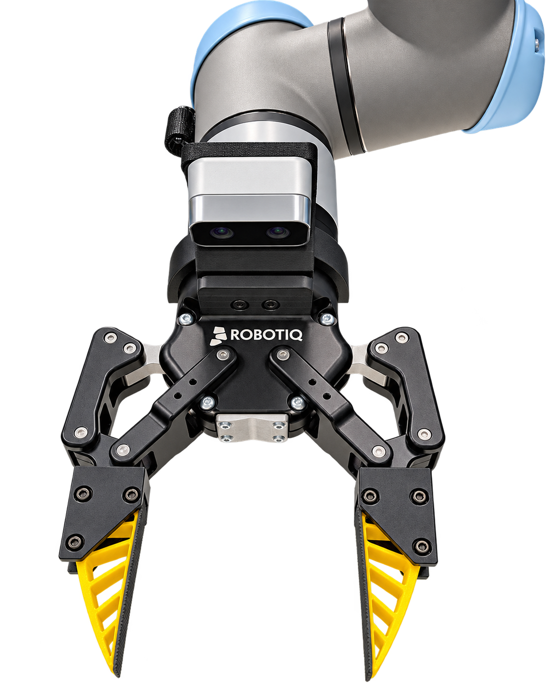

# Robotiq 2F-85 UMI gripper

Prototype UMI-style soft gripper for the Robotiq 2F-85. Each jaw uses a rigid PETG adapter and a compliant TPU 95A gripper body based on the open UMI Fin-Ray-style architecture.

This is an independent experimental design. It is not supplied or endorsed by Robotiq and is not load-rated.

The photo above shows the initial physical prototype. The latest V2 revision below incorporates feedback from that print and awaits physical testing.

## Latest revision: V2

V2 reinforces the screw seats after the initial PETG adapter cracked during tightening. It uses shallow washer seats and uncut M3×30 screws, and brings the bare TPU rails into nominal contact at closure. Tape thickness is ignored for this revision.

- PETG adapter: 26.0 × 40.5 × 26.7 mm
- TPU finger: 15.48 × 74.019 × 23.990 mm
- TPU slot: 15.88 mm, providing 0.20 mm nominal clearance per side
- Three transverse M3 axes at `(Y,Z) = (13,5), (13,19.5), (34,19.5)` mm
- Washer seats: Ø7.5 × 0.6 mm, with 4.46 mm of PETG beneath them
- Captive-nut pockets: 6.3 mm across flats × 2.5 mm deep, with 2.56 mm of PETG beneath them
- Robotiq interface: Ø5.3 mm M5 clearance, 4 mm OEM-derived shoulder, Ø9.2 × 6 mm head/tool pocket, and two Ø2 × 2.5 mm indexing sockets
- Measured Ø8.5 × 4.9 mm M5 head has 1.1 mm axial clearance before the TPU seating face at Y=10 mm
- Closed gaps: 0 mm between bare TPU rails and 1 mm between PETG adapters
- M3×30 screw ends protrude approximately 4.1 mm beyond the PETG

The TPU body is derived from a direct 0.600-scale section of the UMI soft gripper. The original UMI internal cells are grouped into six larger through-bays while retaining the two-rail compliant load path. The PETG carrier is redesigned around the Robotiq removable-fingertip interface.

## V2 print files

Download the **[V2 print pack ZIP](artifacts/V2_PRINT_PACK_20260904.zip)**, or use the individual STLs:

| Part | Material | Copies |
| --- | --- | ---: |
| [Left adapter](artifacts/print_v2_20260904/V2_PETG_LEFT_PRINT_1.stl) | PETG | 1 |
| [Right adapter](artifacts/print_v2_20260904/V2_PETG_RIGHT_PRINT_1.stl) | PETG | 1 |
| [Finger](artifacts/print_v2_20260904/V2_TPU95A_FINGER_PRINT_2.stl) | TPU 95A | 2 |

All three files are already oriented for printing. Import in millimeters at 100% scale and place PETG and TPU on separate plates. PETG prints with the Robotiq mating face down, at 40.5 mm build height; TPU prints broad-side down, at 15.48 mm build height.

**Print all four parts.** The contact-side root hole moved, so the earlier TPU fingers do not match V2. For the pair, use six M3×30 socket-head screws, six M3 washers, and six M3 hex nuts, plus the existing Robotiq mounting hardware.

Washer dimensions remain provisional at 7 mm outside diameter × 0.5 mm thickness; the VIGRUE kit listing does not specify them. Check that the actual washers fit freely before tightening.

See the [print instructions](artifacts/print_v2_20260904/PRINT_README.md) and the existing [Bambu H2D / Overture TPU 95A profile](H2D_OVERTURE_TPU95A_PRINT_SETTINGS.md).

## Editable CAD and verification

- [Full closed-gripper Fusion fit check](artifacts/review_v2_20260904/REVIEW_V2_Robotiq_FITCHECK.f3d)
- [Standalone Fusion assembly](artifacts/review_v2_20260904/REVIEW_V2_ZeroGap_M3x30.f3d)
- [Standalone STEP assembly](artifacts/review_v2_20260904/REVIEW_V2_ZeroGap_M3x30.step)
- [Detailed V2 geometry, hardware assumptions, and QA](artifacts/review_v2_20260904/README.md)

The print meshes are watertight, consistently wound, and each contains one connected solid. All three washer seats and captive-nut pocket mouths are enclosed. Fusion checks found no positive-volume interference among the printed parts and nominal M3 hardware at closure.

Against the official closed Robotiq reference, the new hardware has at least 3.5347 mm clearance. The two previously recorded mounting-interface contacts remain, approximately 0.03682 mm³ per side. These checks cover nominal geometry at closure; they do not establish full-stroke clearance, tightening torque, fatigue life, or payload capacity.

## Rebuilding

Run [`scripts/build_finger_v2_review.py`](scripts/build_finger_v2_review.py) inside Autodesk Fusion, then [`scripts/inspect_finger_v2_review.py`](scripts/inspect_finger_v2_review.py). The generator uses the checked-in source section and writes to the V2 review directory. Its raw STLs retain assembly orientation; the separately supplied print pack contains the oriented versions.

The [V2 notes](artifacts/review_v2_20260904/README.md#reproduce) describe importing the official closed Robotiq reference and running the mechanism fit check. Additional reconstruction utilities are in [`scripts/`](scripts/); their Python dependencies are listed in [`requirements.txt`](requirements.txt).

## Earlier revision

The original STLs and `Skild_Inspired_2F85_Handed` CAD files directly under [`artifacts/`](artifacts/) are retained as the initial prototype. They use the earlier screw seats and 1.5 mm bare-TPU gap. Use the V2 print pack above for the current design.

## Prototype warning

Perform a low-force fit and closure test before carrying a payload. Verify mounting and washer seating, indexing-pin engagement, hardware clearance throughout motion, print tolerances, and TPU stiffness on the physical gripper.
